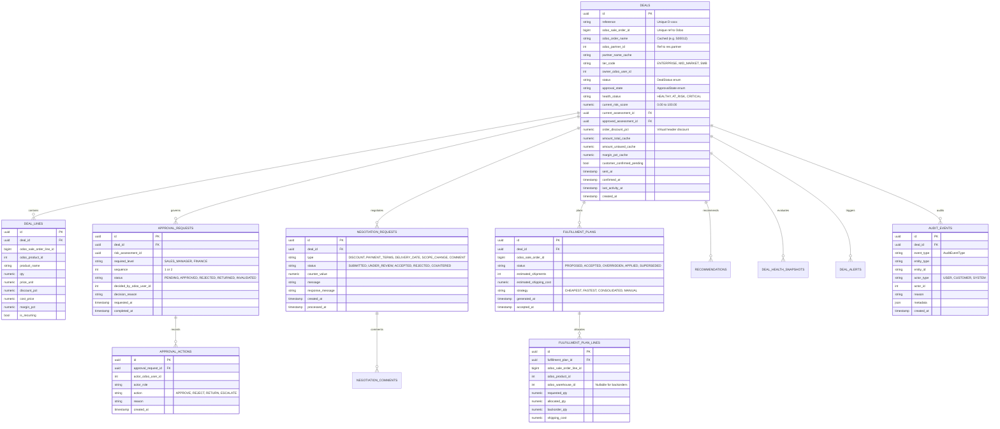
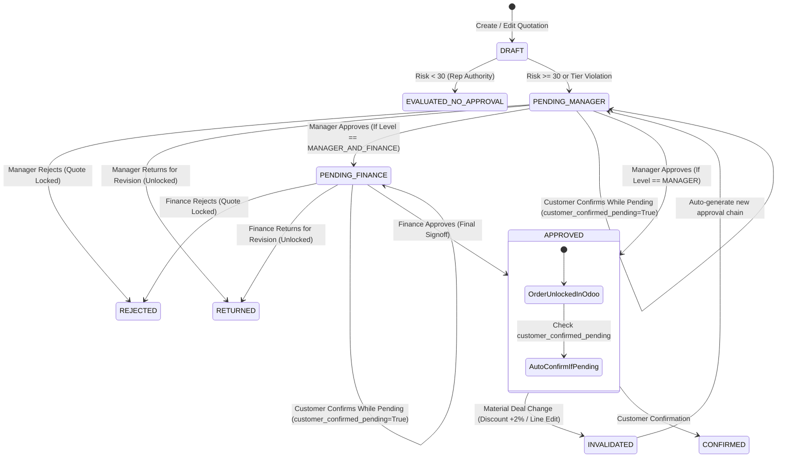
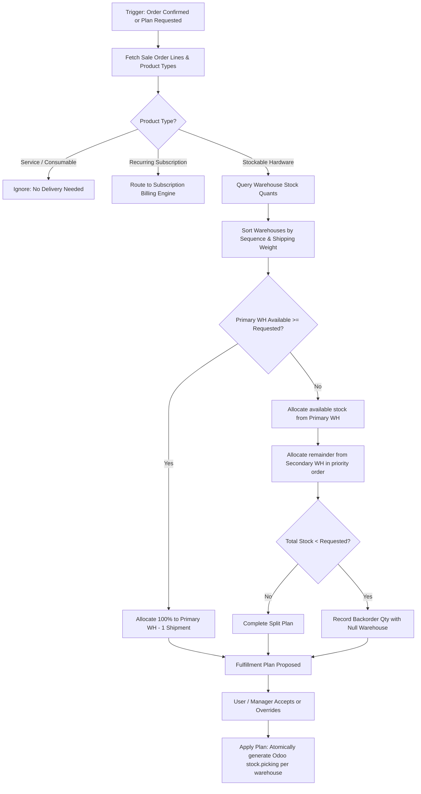
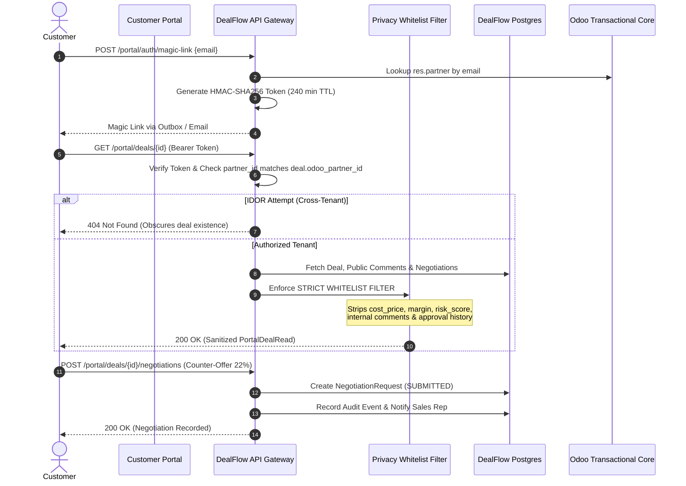

# DealFlow360 — Technical Architecture Specification

> **Core Directive:** *"Odoo owns the transaction. DealFlow governs the transaction."*

---

## 1. System Philosophy & Doctrine

DealFlow360 is an enterprise-grade sales operations and commercial governance overlay designed specifically for **Odoo 18 / 17**. It operates as an autonomous, high-integrity governance engine that enforces commercial policies, mitigates rogue discounting, optimizes multi-warehouse inventory allocations, and orchestrates negotiations—without displacing Odoo as the central transactional ledger of record.

```
┌────────────────────────────────────────────────────────────────────────┐
│                        DEALFLOW360 PLATFORM                            │
│                       "GOVERN THE TRANSACTION"                         │
│  - Real-Time Margin & Risk Scoring (Deal Guardian)                     │
│  - 2-Stage Hierarchical Approval Engine (Manager + Finance)            │
│  - Automated Materiality & Approval Coverage Invalidation              │
│  - Greedy Multi-Warehouse Inventory Splitting (Stockable goods only)   │
│  - Zero-Leak Customer Negotiation Portal (Magic-Link + HMAC token)     │
│  - Health Decay Detection & Next-Best-Action Decision Rules (1-13)     │
└───────────────────────────────────┬────────────────────────────────────┘
                                    │
                         OdooGateway Interface
                     (Fake InMemory / XML-RPC Live)
                                    │
                                    ▼
┌────────────────────────────────────────────────────────────────────────┐
│                              ODOO ERP                                  │
│                        "OWN THE TRANSACTION"                           │
│  - Partner & Customer Master Catalog (`res.partner`)                   │
│  - Product Catalog, Costs & Pricelists (`product.product`)             │
│  - Quotations & Sales Orders (`sale.order`, `sale.order.line`)         │
│  - Physical Warehouses, Stock Quants & Pickings (`stock.picking`)      │
│  - Invoicing, Accounting Moves & Payment Ledgers (`account.move`)      │
└────────────────────────────────────────────────────────────────────────┘
```

### Architectural Division of Responsibilities
1. **Odoo (Transactional Core)**:
   - Holds legal customer records (`res.partner`), standard cost and list prices (`product.product`), stock inventory levels (`stock.quant`), physical pickings (`stock.picking`), and GL entries (`account.move`).
   - Does not contain complex commercial risk algorithms or recursive policy resolution trees.
   - Enforces a boolean lock flag (`dealflow_locked`) and records the current approval state (`dealflow_approval_state`) and risk score (`dealflow_risk_score`).
2. **DealFlow360 (Governance Core)**:
   - Operates a dedicated relational database (`PostgreSQL`) storing deal workspaces, line-level discount overrides, approval chains, negotiation threads, fulfillment plans, health alerts, and immutable audit logs.
   - References Odoo entities strictly by integer ID (`odoo_partner_id`, `odoo_sale_order_id`, `odoo_product_id`, `odoo_warehouse_id`). Never uses cross-database foreign keys.
   - Caches immutable master values (`partner_name_cache`, `amount_total_cache`) to serve portal and control tower reads with sub-millisecond latencies.

---

## 2. Component Architecture

```
                               ┌───────────────────────────┐
                               │   Customer Portal / Web   │
                               │  (Vue / React / Mobile)   │
                               └─────────────┬─────────────┘
                                             │ HTTP / JSON
                                             ▼
┌─────────────────────────────────────────────────────────────────────────────────────────┐
│ FastAPI Application Boundary (`app/`)                                                   │
│                                                                                         │
│  ┌──────────────────────┐  ┌──────────────────────┐  ┌───────────────────────────────┐  │
│  │   Auth & RBAC        │  │  Portal Controller   │  │   Commercial Operations       │  │
│  │  - JWT Bearer        │  │  - Magic-Link Auth   │  │  - Deals & Workspaces         │  │
│  │  - Role Guard (5)    │  │  - Strict Whitelist  │  │  - Approvals & Decisions      │  │
│  │  - Self-Approval Blk │  │  - IDOR Defense      │  │  - Multi-Warehouse Split     │  │
│  └──────────────────────┘  └──────────────────────┘  └───────────────────────────────┘  │
│                                                                                         │
│  ┌───────────────────────────────────────────────────────────────────────────────────┐  │
│  │ Guardian Decision Core (`app/guardian/`)                                          │  │
│  │  - Risk Scoring Engine (Margin, Customer Tier, Category Caps, Warehouse Split)    │  │
│  │  - Approval Coverage Engine (Exact match, tolerance, delta invalidation)          │  │
│  │  - Next-Best-Action Rule Hierarchy (13 strict sequential deterministic rules)     │  │
│  │  - Co-Purchase Product Recommendation Mining (Support, Confidence, Promo Boost)  │  │
│  └───────────────────────────────────────────────────────────────────────────────────┘  │
│                                                                                         │
│  ┌───────────────────────────────────────────────────────────────────────────────────┐  │
│  │ Integration Boundary (`app/odoo/`)                                                 │  │
│  │  - OdooGateway (Abstract Base Class)                                              │  │
│  │  - FakeOdooGateway (High-fidelity test harness with isolated memory stores)       │  │
│  │  - XmlRpcOdooGateway (Odoo 18 / 17 XML-RPC protocol implementation)               │  │
│  │  - Outbox Pattern (Transactional delivery with exponential backoff & idempotency) │  │
│  └───────────────────────────────────────────────────────────────────────────────────┘  │
└────────────────────────────────────────────┬────────────────────────────────────────────┘
                                             │
                       ┌─────────────────────┴─────────────────────┐
                       ▼                                           ▼
            ┌─────────────────────┐                     ┌─────────────────────┐
            │  DealFlow Postgres  │                     │   Odoo 18 Server    │
            │  (Governance State) │                     │ (Transactional ERP) │
            └─────────────────────┘                     └─────────────────────┘
```

---

## 3. Entity-Relationship Diagram (ERD)

The DealFlow relational schema isolates commercial decision states, approvals, and audit trails:



---

## 4. Approval State Machine & Invalidation Engine

DealFlow360 enforces a deterministic, two-stage hierarchical approval state machine:



### Invalidation & Approval Coverage Rules
- When a deal is modified (e.g. rep increases discount, or accepts customer counter-offer):
  1. The Guardian Risk Engine recalculates the risk score and required approval level.
  2. The **Coverage Evaluator** checks the current state against `approved_assessment_id`.
  3. If current terms exceed approved boundaries (e.g. discount increase $\ge 2.0\%$, margin drop, or new unreviewed line items), the live approval is immediately **INVALIDATED**.
  4. The quotation is automatically re-locked in Odoo (`dealflow_locked=True`), and a new approval chain is initialized at `PENDING_MANAGER`.

---

## 5. Multi-Warehouse Fulfillment Splitting Engine

Physical delivery execution follows a greedy optimization algorithm that strictly differentiates stockable goods from non-deliverable items:



### Invariants Enforced
- **Line Quantity Conservation**: For every order line, $\sum(\text{allocated\_qty}) + \text{backorder\_qty} = \text{requested\_qty}$.
- **Zero Overselling**: $\text{allocated\_qty} \le \text{available\_qty}$ for each individual warehouse.
- **Service Isolation**: Intangible services and recurring licenses are strictly excluded from inventory reservation.

---

## 6. Zero-Leak Customer Portal Security Architecture

The DealFlow Customer Portal provides interactive counter-negotiation capabilities while guaranteeing zero leakage of proprietary internal commercial data:



### Portal Data Privacy Defense Matrix
| Field Name | Rep / Manager Workspace | Customer Portal (`PortalDealRead`) |
| :--- | :---: | :---: |
| `cost_price` | ✅ Included | 🚫 **Strip & Forbid** |
| `margin_pct` | ✅ Included | 🚫 **Strip & Forbid** |
| `margin_amount` | ✅ Included | 🚫 **Strip & Forbid** |
| `current_risk_score` | ✅ Included | 🚫 **Strip & Forbid** |
| `approval_state` | ✅ Included | 🚫 **Strip & Forbid** |
| Internal Notes / Chatter | ✅ Included | 🚫 **Strip & Forbid** |
| List Price & Discount | ✅ Included | ✅ Included |
| Subtotal & Tax | ✅ Included | ✅ Included |
| Public Comments | ✅ Included | ✅ Included |
| Delivery Dates | ✅ Included | ✅ Included |

---

## 7. Next-Best-Action (NBA) Engine Architecture

The DealFlow Control Tower executes a deterministic 13-rule priority cascade to present sales reps and managers with their single most urgent required action:

```
Priority 1:  REAPPROVAL_REQUIRED           (Invalidated approval chain)
Priority 2:  FINANCE_APPROVAL_REQUIRED      (Stage 2 pending finance)
Priority 3:  MANAGER_APPROVAL_REQUIRED      (Stage 1 pending manager)
Priority 4:  CUSTOMER_COUNTER_OFFER_PENDING (Customer submitted counter-offer)
Priority 5:  QUOTATION_EXPIRED              (Quotation validity expired)
Priority 6:  DELIVERY_SLIPPAGE_RISK         (Warehouse shortage / delay)
Priority 7:  PROPOSED_FULFILLMENT_AVAILABLE (Fulfillment plan needs acceptance)
Priority 8:  PAYMENT_OVERDUE                (Invoice past payment term)
Priority 9:  STALLED_DEAL_DETECTED          (Inactivity threshold breached)
Priority 10: DISCOUNT_ANOMALY_DETECTED      (Discount deviates from baseline)
Priority 11: RECOMMENDATIONS_AVAILABLE      (High-confidence co-purchase item)
Priority 12: READY_TO_SEND                  (Quotation approved, not sent)
Priority 13: REGULAR_CADENCE_FOLLOWUP       (Healthy deal cadence)
```

Each action item includes an actionable title, human-readable rationale, and a deep link (`/deals/{deal_id}`) directing the user directly to the relevant workspace view.

---

## 8. Webhook & Event Bus Flow

Outbound and inbound events are orchestrated through an idempotent, transaction-safe event bus:

1. **Inbound Odoo Webhooks (`POST /api/v1/events/odoo`)**:
   - Webhook requests verify HMAC-SHA256 signatures via `X-Odoo-Signature` or Bearer tokens against `ODOO_WEBHOOK_SECRET`.
   - The handler checks `ProcessedEvent` table by `event_id`. Duplicate events return HTTP 200 `{"status": "duplicate"}` immediately without duplicate reprocessing.
   - Synchronizes order status (`sale_order.cancelled`, `sale_order.updated`) and records `AuditEvent` records with full traceability.
2. **Outbound Notification Dispatch**:
   - In-memory event dispatcher broadcasts notifications with SSRF URL validation, blocking loopback addresses, RFC-1918 private ranges, and cloud metadata endpoints (`169.254.169.254`).
